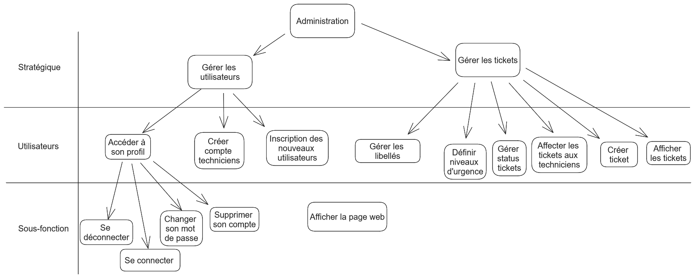

# Recueil des besoins

**Godineau Thomas**, **Rodier Matis**, **Chiron Jules**, **Ouvrard Maxence**

Groupe : **INF2 - FI A**

## Objectif et portée

L’objectif général de ce projet est la gestion d’un système de ticketing qui sera implémenté en PHP et MySQL.
Il aura pour but de recueillir les demandes de dépannage de différents utilisateurs dans les salles de l'établissement.
La plateforme de ticketing devra être accessible par l’intermédiaire de n’importe quel autre poste de l’IUT.
Nous devons réaliser cette plateforme par groupe de quatre. Le projet doit  être complètement fini et déposé en janvier.

### Liste des acteurs, objets et actions

| Acteurs               | Objets                           | Actions                                                          |
|-----------------------|----------------------------------|------------------------------------------------------------------|
| étudiants             | Application web                  | Formuler des demandes                                            |
| professeurs           | plateforme de tickecting         | Accueillir les users                                             |
| utilisateurs          | page d'accueil                   | ~~proposer texte explicatif~~                                    |
| admin système         | texte explicatif                 | consulter différentes demandes                                   |
| admin web             | tableau de bord                  | visualiser 10 dernières demandes                                 |
| techniciens           | demandes                         | s'inscrire sur la plateforme                                     |
| utilisateurs inscrits | statut des demandes              | ouvrir un ticket                                                 |
| visiteurs             | vidéo de démonstration           | changer son mdp                                                  |
| clients               | formulaire d'inscription         | accéder à son profil                                             |
| M. Hoguin             | CAPTCHA                          | se connecter                                                     |
|                       | lien vers page en construction   | se connecter en ssh                                              |
|                       | base de données                  | gérer liste des libellés                                         |
|                       | login                            | modifier statut des tickets                                      |
|                       | mot de passe                     | définir les niveaux d'urgence                                    |
|                       | liste des libellés               | créer comptes techniciens                                        |
|                       | ticket (ouvert, fermé, en cours) | se déconnecter                                                   |
|                       | niveaux d'urgence                | visualiser tickets                                               |
|                       | comptes                          | affecter tickets aux techniciens                                 |
|                       | journaux d'activités             | ~~techniciens se connectent~~                                    |
|                       | date                             | techniciens s'attribuent les tickets eux-même                    |
|                       | adresse ip                       | changer état de tickets pris en charge                           |
|                       | historique                       | consulter journaux d'activité                                    |
|                       | statistiques                     | création journal d'activité (pour chaque tentative de connexion) |
|                       | système                          | création historique de tickets fermés                            |
|                       | serveur web                      | supprimer un compte                                              |
|                       | serveur SGBD                     |                                                                  |
|                       | RPi4                             |                                                                  |
|                       | connexion ssh                    |                                                                  |
|                       | carte sd                         |                                                                  |
|                       | documentation                    |                                                                  |
|                       | dépôt distant                    |                                                                  |
|                       | code                             |                                                                  |
|                       | nature du problème               |                                                                  |
|                       | salle d'où vient le problème     |                                                                  |

## Glossaire

Ce glossaire définit les mots complexes utilisés dans le cahier des charges.

| Mot                     | Définition                                                                                                                                                                           |
|-------------------------|--------------------------------------------------------------------------------------------------------------------------------------------------------------------------------------|
| Application web         | Logiciel qui s'exécute dans un navigateur                                                                                                                                            |
| Plateforme de ticketing | Plateforme permettant de signaler des problèmes informatiques (1 problème = 1 ticket) afin que leur dépannage soit pris en charge                                                    |
| CAPTCHA                 | 'Completely Automated Public Turing test to tell Computers and Humans Apart' est un système d'authentification permettant de différencier les utilisateurs humains de robots         |
| Libellé                 | Titre d'un ticket                                                                                                                                                                    |
| Ticket                  | Demande de dépannage, contient la nature du problème, un niveau d'urgence, le demandeur, le lieu et la description du problème. Il peut être ouvert, fermé ou en cours de traitement |
| Journal d'activité      | Recueil de différentes actions qui ont eu lieu sur le serveur et de leur détails (historique de connexions ...)                                                                      |
| Adresse IP              | 'Internet Protocol', adresses liées aux différents appareils numériques qui nous entoure, permet de différencier les différentes personnes qui se connectent à la plateforme         |
| Serveur web             | Système permettant de lier les pages web entre elles (ici Apache)                                                                                                                    |
| Serveur SGBD            | Serveur de 'Système de Gestion de Base de Données', système de base de données lié à la plateforme (MySQL, MariaDB ...)                                                              |
| RPi 4                   | Raspberry Pi 4 : Nano-ordinateur supportant notre plateforme                                                                                                                         |
| Connexion ssh           | Connexion 'Secure Shell' : protocole de communication permettant de se connecter au serveur                                                                                          |

## Cas d'utilisations

### Tableaux de définition des cas d’utilisation

| 🪁 (Niveau Stratégique) 🔲|
|----------------------------|
| Gérer les utilisateurs     |
| Configuration du système   |
| Gérer les tickets          |

| 🌊 (Niveau Utilisateur) ⬛                                                     |
|---------------------------------------------------------------------------------|
| Créer ticket                                                                    |
| Accéder à son profil                                                            |
| Afficher les tickets                                                            |
| Gérer liste libellés                                                            |
| Gérer status tickets                                                            |
| Définir les niveaux d’urgence                                                   |
| Creer comptes techniciens                                                       |
| Consulter journaux d’activités                                                  |
| Inscription des nouveaux utilisateurs                                           |
| Affecter les tickets aux techniciens (les techniciens s’attribuent les tickets) |
| Modifier les utilisateurs                                                       |

| 🐟 (Niveau Sous-fonction) |
|---------------------------|
| Se connecter (+ en ssh)   |
| Se déconnecter            |
| Changer son mdp           |
| Supprimer un compte       |
| Afficher un page          |
| Changer la police         |
| Changer la langue         |
| Change la photo de profil |

On peut représenter les différents cas d'utilisation et leur correspondances.

**Figure 1** : Représentation des cas d'utilisation

### Niveau Sous-fonction

| Cas d'utilisation 1 : Se connecter                                                                                                                                                                                                                                                                                                                                                                                                         |
|--------------------------------------------------------------------------------------------------------------------------------------------------------------------------------------------------------------------------------------------------------------------------------------------------------------------------------------------------------------------------------------------------------------------------------------------|
| **Nom** : Se connecter                                                                                                                                                                                                                                                                                                                                                                                                                     |
| **Portée** : Application Web                                                                                                                                                                                                                                                                                                                                                                                                               |
| **Niveau** : Sous-fonction                                                                                                                                                                                                                                                                                                                                                                                                                 |
| **Acteurs Principaux** : Utilisateur, Administrateur Web                                                                                                                                                                                                                                                                                                                                                                                   |
| **Scénario nominal** :<ol><li>L'utilisateur entre son login et son mot de passe</li><li>Récupérer les données et chercher dans la base de données</li><li>Récupérer le statut de l'utilisateur</li><li>Redirige vers la page correspondante</li></ol>                                                                                                                                                                                      |
| **Extension** :<ul><li>Si les informations données correspondent à un administrateur web<ul><li>Redirection vers la page administrateur web</li></ul></li><li>Si les informations données correspondent à un utilisateur<ul><li>Redirection vers la page d'accueil en étant connecté</li></ul></li><li>Si les informations données sont incorrectes<ul><li>Redirection vers la page d'accueil avec un message d'erreur</li></ul></li></ul> |

| Cas d'utilisation 2 : Se déconnecter                                                                                                                         |
|--------------------------------------------------------------------------------------------------------------------------------------------------------------|
| **Nom** : Se déconnecter                                                                                                                                     |
| **Portée** : Application Web                                                                                                                                 |
| **Niveau** : Sous-fonction                                                                                                                                   |
| **Acteurs Principaux** : Utilisateur, Administrateur Web                                                                                                     |
| **Scénario** : <ol><li>L'acteur clique sur le bouton "se déconnecter"</li><li>Redirige sur la page d'accueil avec le message "déconnexion réussie"</li></ol> |

| Cas d'utilisation 3 : Changer de mot de passe                                                                                                                                                 |
|-----------------------------------------------------------------------------------------------------------------------------------------------------------------------------------------------|
| **Nom** : Changer de mot de passe                                                                                                                                                             |
| **Portée** : Base de donnée                                                                                                                                                                   |
| **Niveau** : Sous-fonction                                                                                                                                                                    |
| **Acteurs principaux** : Utilisateur                                                                                                                                                          |
| **Scénario** : <ol><li>L'utilisateur remplit les champs pour pouvoir changer son mot de passe</li><li>Change dans la base de données le mot de passe de l'utilisateur correspondant</li></ol> |
| **Extensions** : <ul><li>Si les données ne sont pas correctes<ul><li>Ne modifie pas la base de données et renvoie un message d'erreur</li></ul></li></ul>                                     |

| Cas d'utilisation 4 : Supprimer un compte                                                            |
|------------------------------------------------------------------------------------------------------|
| **Nom** : Supprimer un compte                                                                        |
| **Portée** : Base de donnée                                                                          |
| **Niveau** : Sous-fonction                                                                           |
| **Acteurs principaux** : Utilisateur                                                                 |
| **Scénario** : <ol><li>L'utilisateur se connecte</li><li>L'utilisateur supprime son compte</li></ol> |

| Cas d'utilisation 5 : Afficher une page web                                       |
|-----------------------------------------------------------------------------------|
| **Nom** : Affiche une page web                                                    |
| **Portée** : site statique                                                        |
| **Niveau** : Sous-fonction                                                        |
| **Acteurs principaux** : Utilisateur                                              |
| **Scénario** : <ol><li>L'utilisateur clique sur un lien de la page html</li></ol> |

| Cas d'utilisation 19 : Changer la police d'écriture                                                           |
|---------------------------------------------------------------------------------------------------------------|
| **Nom** : Changer la police                                                                                   |
| **Portée** : Application web                                                                                  |
| **Niveau** : Sous-fonction                                                                                    |
| **Acteurs principaux** : visiteurs, utilisateurs, techniciens, admins                                         |
| **Scénario** : <ol><li>L'acteur accède au site</li><li>L'utilisateur peut changer la police du site</li></ol> |

| Cas d'utilisation 20 : Changer la langue                                                                                  |
|---------------------------------------------------------------------------------------------------------------------------|
| **Nom** : Changer la langue                                                                                               |
| **Portée** : Application web                                                                                              |
| **Niveau** : Sous-fonction                                                                                                |
| **Acteurs principaux** : visiteurs, utilisateurs, techniciens, admins                                                     |
| **Scénario** : <ol><li>L'acteur accède au site</li><li>L'utilisateur peut changer la langue d'affichage du site</li></ol> |

| Cas d'utilisation 22 : Changer de mot de passe                                                                                                                       |
|----------------------------------------------------------------------------------------------------------------------------------------------------------------------|
| **Nom** : Changer la photo de profil                                                                                                                                 |
| **Portée** : Base de donnée                                                                                                                                          |
| **Niveau** : Sous-fonction                                                                                                                                           |
| **Acteurs principaux** : Utilisateur                                                                                                                                 |
| **Scénario** : <ol><li>L'utilisateur choisi la photo dans son répertoire de fichier</li><li>Il appuie sur le bouton Valider</li></ol>                                |
| **Extensions** : <ul><li>Si l'image sélectionnée n'est pas au bon format<ul><li>Ne modifie pas la base de données et renvoie un message d'erreur</li></ul></li></ul> |                                  

### Niveau utilisateur

| Cas d'utilisation 6 : Créer ticket                                                                                                                                               |
|----------------------------------------------------------------------------------------------------------------------------------------------------------------------------------|
| **Nom** : Création d'un ticket                                                                                                                                                   |
| **Portée** : Base de donnée                                                                                                                                                      |
| **Niveau** : Utilisateur                                                                                                                                                         |
| **Acteurs principaux** : Utilisateur                                                                                                                                             |
| **Scénario** : <ol><li>L'utilisateur se connecte</li><li>Il remplit les champs nécessaire à la création d'un ticket</li><li>Création du ticket dans la base de données</li></ol> |

| Cas d'utilisation 7 : Accéder à son profil                                                                                                                                                                  |
|-------------------------------------------------------------------------------------------------------------------------------------------------------------------------------------------------------------|
| **Nom** : Accéder à son profil                                                                                                                                                                              |
| **Portée** : Application web                                                                                                                                                                                |
| **Niveau** : Utilisateur                                                                                                                                                                                    |
| **Acteurs principaux** : Utilisateur                                                                                                                                                                        |
| **Scénario** : <ol><li>L'utilisateur se connecte</li><li>Il accède à son profil</li><li>Il peut changer son mot de passe</li><li>Il peut supprimer son compte</li><li>L'utilisateur se déconnecte</li></li> |

| Cas d'utilisation 8 : Accéder au tableau de bord                                                                                                                                                                          |
|---------------------------------------------------------------------------------------------------------------------------------------------------------------------------------------------------------------------------|
| **Nom** : Afficher les tickets                                                                                                                                                                                            |
| **Portée** : Application web                                                                                                                                                                                              |
| **Niveau** : Utilisateur                                                                                                                                                                                                  |
| **Acteurs principaux** : Utilisateur                                                                                                                                                                                      |
| **Scénario** : <ol><li>L'utilisateur se connecte</li><li>Il accède à son tableau de bord</li><li>Il peut créer un ticket</li><li>Il à accès à tous les tickets qu'il a créé</li><li>L'utilisateur se déconnecte</li></ol> |

| Cas d'utilisation 9 : Gérer liste libellés                                                                                                                       |
|------------------------------------------------------------------------------------------------------------------------------------------------------------------|
| **Nom** : Gérer liste libellés                                                                                                                                   |
| **Portée** : Base de donnée                                                                                                                                      |
| **Niveau** : Utilisateur                                                                                                                                         |
| **Acteurs principaux** : Administrateur web                                                                                                                      |
| **Scénario** : <ol><li>L'administrateur se connecte</li><li>L'administrateur web peut modifier les libellés</li><li>L'administrateur web se déconnecte</li></ol> |

| Cas d'utilisation 10 : Gérer status tickets                                                                                                                              |
|--------------------------------------------------------------------------------------------------------------------------------------------------------------------------|
| **Nom** : Gérer status tickets                                                                                                                                           |
| **Portée** : Base de données                                                                                                                                             |
| **Niveau** : Utilisateur                                                                                                                                                 |
| **Acteurs principaux** : Administrateur web                                                                                                                              |
| **Scénario** : <ol><li>L'administrateur se connecte</li><li>L'administrateur web peut changer le statut d'un ticket</li><li>L'administrateur web se déconnecte</li></ol> |

| Cas d'utilisation 11 : Définir les niveaux d’urgence                                                                                                                                |
|-------------------------------------------------------------------------------------------------------------------------------------------------------------------------------------|
| **Nom** : Définir les niveaux d’urgence                                                                                                                                             |
| **Portée** : Base de données                                                                                                                                                        |
| **Niveau** : Utilisateur                                                                                                                                                            |
| **Acteurs principaux** : Administrateur web                                                                                                                                         |
| **Scénario** : <ol><li>L'administrateur se connecte</li><li>L'administrateur web peut modifier le niveau d'urgence d'un ticket</li><li>L'administrateur web se déconnecte</li></ol> |

| Cas d'utilisation 12 : Creer comptes techniciens                                                                                                                            |
|-----------------------------------------------------------------------------------------------------------------------------------------------------------------------------|
| **Nom** : Creer comptes techniciens                                                                                                                                         |
| **Portée** : Base de données                                                                                                                                                |
| **Niveau** : Utilisateur                                                                                                                                                    |
| **Acteurs principaux** : Administrateur web                                                                                                                                 |
| **Scénario** : <ol><li>L'administrateur se connecte</li><li>L'administrateur web peut créer des comptes de techniciens</li><li>L'administrateur web se déconnecte</li></ol> |

| Cas d'utilisation 13 : Consulter journaux d’activités                                                                                                                            |
|----------------------------------------------------------------------------------------------------------------------------------------------------------------------------------|
| **Nom** : Consulter journaux d’activités                                                                                                                                         |
| **Portée** : Journaux d'activités                                                                                                                                                |
| **Niveau** : Utilisateur                                                                                                                                                         |
| **Acteurs principaux** : Administrateur système                                                                                                                                  |
| **Scénario** : <ol><li>L'administrateur se connecte</li><li>L'administrateur système peut consulter les journaux d'activité</li><li>L'administrateur web se déconnecte</li></ol> |

| Cas d'utilisation 14 : Inscription des nouveaux utilisateurs                       |
|------------------------------------------------------------------------------------|
| **Nom** : Inscription des nouveaux utilisateurs                                    |
| **Portée** : Base de données                                                       |
| **Niveau** : Utilisateur                                                           |
| **Acteurs principaux** : Utilisateur                                               |
| **Scénario** : <ol><li>L'utilisateur non-inscrit peut se créer un compte</li></ol> |

| Cas d'utilisation 15 : Affecter les tickets aux techniciens                                                                                                                                                                                     |
|-------------------------------------------------------------------------------------------------------------------------------------------------------------------------------------------------------------------------------------------------|
| **Nom** : Affecter les tickets aux techniciens                                                                                                                                                                                                  |
| **Portée** : Base de données                                                                                                                                                                                                                    |
| **Niveau** : Utilisateur                                                                                                                                                                                                                        |
| **Acteurs principaux** : Administrateur web, techniciens                                                                                                                                                                                        |
| **Scénario** : <ol><li>L'administrateur ou le technicien se connecte</li><li>L'administrateur web peut attribuer un ticket à un technicien ou celui-ci peut s'en attribuer un</li><li>L'administrateur ou le technicien se déconnecte</li></ol> |

| Cas d'utilisation 21 : Modifier les utilisateurs |
|--------------------------------------------------|
| **Nom** : Modifier les utilisateurs |
| **Portée** : Application web |
| **Niveau** : Utilisateurs    |
| **Acteurs principaux** : admin web |
| **Scénario** : <ol><li>L'acteur se connecte à la plateforme</li><li>L'utilisateur peut afficher la liste des utilisateurs et les modifier</li></ol> |

### Niveau stratégique

| Cas d'utilisation 16 : Gérer les utilisateurs                                                                                                                                                        |
|------------------------------------------------------------------------------------------------------------------------------------------------------------------------------------------------------|
| **Nom** : Gérer les utilisateurs                                                                                                                                                                     |
| **Portée** : Base de donnée                                                                                                                                                                          |
| **Niveau** : Stratégique                                                                                                                                                                             |
| **Acteurs principaux** : Utilisateurs                                                                                                                                                                |
| **Scénario** : <ol><li>L'utilisateur peut se créer un compte s'il n'est pas inscrit</li><li>Il peut accéder à son compte</li><li>Créer un compte technicien s'il est un administrateur web</li></ol> |

| Cas d'utilisation 17 : Configuration du système                                                                                                                                                                               |
|-------------------------------------------------------------------------------------------------------------------------------------------------------------------------------------------------------------------------------|
| **Nom** : Configuration du système                                                                                                                                                                                            |
| **Portée** : Base de donnée                                                                                                                                                                                                   |
| **Niveau** : Stratégique                                                                                                                                                                                                      |
| **Acteurs principaux** : Administrateur système                                                                                                                                                                               |
| **Scénario** : <ol><li>L'administrateur système se connecte</li><li>Il gère la base de données de l'application web</li><li>Il gère l'administration réseau du serveur</li><li>Il consulte les journaux d'activités</li></ol> |

| Cas d'utilisation 18 : Gérer les tickets                                                                                                                                                                                                                                                                                        |
|---------------------------------------------------------------------------------------------------------------------------------------------------------------------------------------------------------------------------------------------------------------------------------------------------------------------------------|
| **Nom** : Gérer les tickets                                                                                                                                                                                                                                                                                                     |
| **Portée** : Base de donnée                                                                                                                                                                                                                                                                                                     |
| **Niveau** : Stratégique                                                                                                                                                                                                                                                                                                        |
| **Acteurs principaux** : Utilisateur, Administrateur web                                                                                                                                                                                                                                                                        |
| **Scénario** : <ol><li>L'utilisateur ou l'administrateur web se connecte</li><li>L'utilisateur peut créer un ticket</li><li>L'administrateur web peut : <ul><li>Définir les niveaux d'urgence</li><li>Affecter les tickets aux techniciens</li><li>Gérer les statuts des tickets</li><li>Gérer les libellés</li></ul></li></ol> |                               |

## La technologie employée

Le site va être effectué en PHP, MySQL, HTML, CSS. Le serveur Apache2 devra tourner sur un système Linux installé sur un Raspberry Pi.
Il faudra se connecter en ssh afin que les autres utilisateurs puissent accéder à la plateforme.
Il y aura des pages web dynamiques et statiques se mettant à jour grâce à une base de données qui se remplit par
l’intermédiaire des différentes actions des utilisateurs.

## Autres exigences

Nous allons rendre un premier livrable contenant le site web static.
C'est-à-dire les pages HTML du site avec le fichier CSS associé. Le site sera navigable mais on ne pourra interagir avec le site.
Ce premier livrable sera rendu pour le 22/10/2023.
Le deuxième livrable contiendra le site web final en PHP avec le CSS correspondant, le serveur Apache2 fonctionnel et la base de données + le dossier de gestion des risques.
Nous rendrons ce deuxième livrable le 05/11/2023
Le troisième livrable sera le Raspberry Pi contenant la carte SD sur laquelle sera configuré le serveur LAMP (Linux, Apache2, MySql, PHP).
Celui ci sera rendu le 12/11/2023
Les participants au projet sont Jules Chiron, Matis Rodier, Thomas Godineau, Maxence Ouvrard. Nous privilégions
l’accessibilité pour tous sur notre plateforme.
Nous souhaitons que les utilisateurs trouvent des réponses aux problèmes qu’ils rencontrent le plus efficacement et rapidement possible.
Nous allons devoir installer Apache, PHP, MySQL afin que la plateforme puisse fonctionner correctement.
De plus, le site doit ressembler aux maquettes que nous avons réalisées en amont.
Ce projet est soumis à des dépendances client/utilisateurs car notre site dépend de la satisfaction de ces personnes .
De plus ce projet à des dépendances techniques vis-à-vis de la base de données du site, la connexion au serveur Apache,
l'accessibilité au Raspberry Pi sur lequel le serveur sera installé.

## Recours humain, questions juridiques, politiques, organisationnelles

Comme nous l'avons vu précédemment, l'équipe de développement se compose de quatre personnes.
Ils ont pour objectif de réaliser le projet dans son intégralité, c'est-à-dire la rédaction du cahier des charges,
la création du serveur, de la base de données, des pages web, du logo,...
Leur objectif est donc de fournir le produit afin que les utilisateurs puissent l'utiliser de manière correcte et simple.
Il existe une autre catégorie de personnes dans le recours humain au fonctionnement de ce projet.
En effet, il s'agit d'une plateforme de ticketing, alors le produit fini ne peut vivre sans les utilisateurs finaux.
Parmi eux, nous retrouvons les visiteurs qui consultent le site, les utilisateurs qui utilisent le site en créant des tickets,
l'administrateur système qui peut accéder au journal d'activité et l'administrateur web qui peut gérer les informations liées aux tickets.
Il s'agit donc d'une plateforme qui doit être utilisée quotidiennement par les utilisateurs finaux afin qu'elle soit utile.
Notre plateforme, utilisant des données utilisateurs, se doit d'être conforme à certaines règles.
En effet, les développeurs se doivent de créer une plateforme sécurisée afin que les données soient protégées.
Tout d'abord, ce projet est réalisé en France et doit donc respecter la vie privée des utilisateurs.
Pour ce faire, le projet doit respecter la norme RGPD. Ensuite, les mots de passe utilisateurs devront être enregistrés avec un format md5 par exemple,
pour qu'aucune personne n'ait accès aux mots de passe en clair, que ce soit les développeurs,
les différents administrateurs de l'application ou encore de personnes mal intentionnées.
Enfin, le projet se doit d'être accessible à tous. En effet, depuis quelques années,
la France a une loi qui oblige les développeurs à réaliser leurs sites et applications avec des normes d'accessibilité.
La création d'une telle application web va avoir des impacts sur les différents utilisateurs qui l'utilisent.
En effet, l'introduction de cet outil dans l'enceinte de l'IUT va demander un changement d'habitudes pour les élèves ou professeurs (qui seront des utilisateurs)
car pour le bon fonctionnement de celle-ci, il faudra une connexion fréquente afin de reporter les différents problèmes ainsi que de voir leur état d'avancement.
Pour les deux administrateurs, il leur faudra aussi utiliser très fréquemment cette application afin de répondre aux utilisateurs.
De plus, il leur faudra apprendre à utiliser l'application, même si celle-ci se veut simple d'accès.
Pour le bon fonctionnement, il faut que cette application soit déployable sur l'ensemble du parc informatique de l'IUT.
Pour que chaque utilisateur puisse utiliser le site correctement, une vidéo explicative sera réalisée afin d'expliquer de manière claire et simple le fonctionnement correct de l'application.
