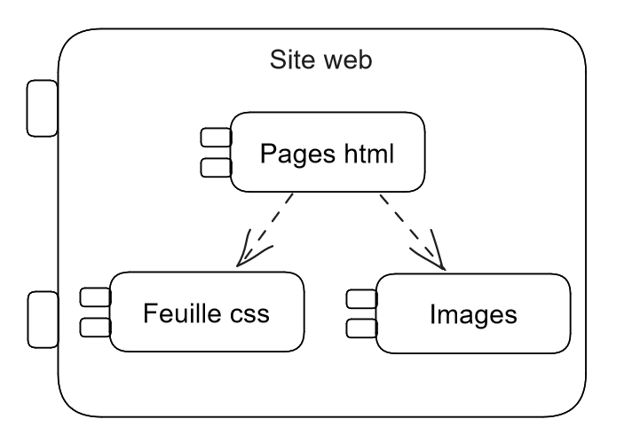

# Conception architecturale

**Godineau Thomas**, **Rodier Matis**, **Chiron Jules**

## Introduction

Nous choisissons de représenter la conception architecturale du projet par une vue composant-connecteur.
Effectivement, cette vue est la plus adaptée pour un site web car chaque composant représente un type de donnée.

## Site web

Le premier livrable du projet contient le site web statique. Elle contient un ensemble de pages html,  une feuille de style CSS et des images.
On créé donc trois packages :

- Pages html : abstraction des pages html de la maquette

- Feuille css : abstraction de la feuille de style de la maquette

- Images : abstraction des images utilisées sur le site

Les pages html dépendent de la feuille de style et des images. On peut rassembler ces packages sous un grand package qu’on appelle site web. Cela est représenté par la figure 2.

**Figure 2** : Représentation de la conception architecturale
