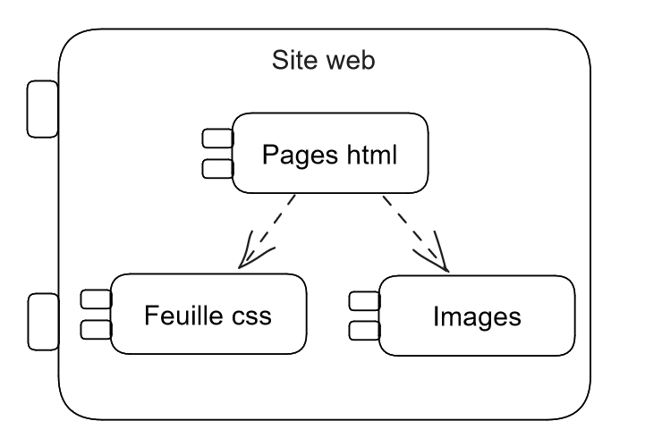

# Conception architecturale

**Godineau Thomas**

**Rodier Matis**

**Chiron Jules**

**Ouvrard Maxence**

La version V1 du projet contient le site web statique. Elle contient un ensemble de pages html,  une feuille de style CSS et des images.
On créé donc trois packages :

- Pages html

- Feuille css

- Images

Les pages html dépendent de la feuille de style et des images. On peut rassembler ces packages sous un grand package qu’on appelle site web. Cela est représenté par la figure 2.

**Figure 2** : Représentation de la conception architecturale
