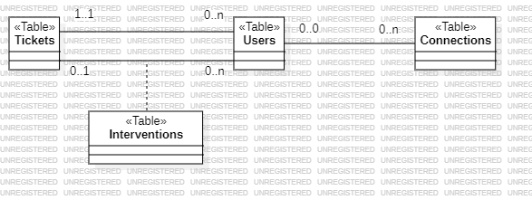

# Conception architecturale

**Godineau Thomas**, **Rodier Matis**, **Chiron Jules**

Groupe : **INF2 - FI A**

## Introduction

Nous choisissons de représenter la conception architecturale du projet par une vue composant-connecteur. Effectivement, cette vue est la plus adaptée pour un site web, car chaque composant représente un type de donnée. Nous rappelons que dans cette version, nous n'avons pas installé le serveur sur le RaspberryPi.

## Projet global

Tout d'abord nous allons réaliser la conception architecturale du projet dans sa globalité (hors installation sur Raspberry Pi). Nous devons réfléchir à quels sont les grands objets du projet à haut niveau d'abstraction.

Nous définissons 4 grands objets :

- Le **navigateur internet** : biais par lequel l'utilisateur va accéder au site web.
- La **base de données** : base de données ***MySql*** permettant de stocker toutes les données relatives aux tickets et aux utilisateurs
- Le **site web** : site web ***PHP*** qui sera le corps de l'application
- Le **serveur web** : serveur ***Apache2*** qui fera la connexion entre la base de données, le navigateur du client et le site web

Maintenant que nous avons nos objets, nous devons définir les relations entre ces grands objets.

- Le serveur web est dépendant du site web
- Le serveur web accède à la base de données par l'interface I_BD
- Le navigateur internet accède au serveur web par l'interface Requête

La [figure 1](#figure1) représente la conception architecturale du projet global.

## Base de données

Cette section est la conception architecturale du projet à l'abstraction au domaine de la base de données. On définit tout d'abord trois tables :

- **Users** : Table qui contient tous les utilisateurs
- **Tickets** : Table qui contient tous les tickets
- **Connections** : Table qui contient toutes les tentatives de connexions sur le site (réussies et échouées).

Les tables **User** et **Tickets** sont reliées par une relation d'**association**. Un utilisateur peut avoir le nombre de tickets qu'il veut, mais un ticket n'a qu'un utilisateur. La table **Connections** est en association avec la table **User**.

Mais en revenant au [cahier des charges](../Analyse/cahier_des_charges.md), on s'aperçoit qu'on doit utiliser une table **Interventions** qui est une classe association entre Users et Tickets. En effet, cette table correspond à la prise en charge d'un ticket par un technicien. Elle n'existe que s'il y a un ticket à traiter et un technicien.

On obtient donc la représentation présentée par la [figure 2](#figure2).

## Site web

Cette section est la conception architecturale du projet à l'abstraction au domaine du site web. On a les objets :

- **Pages PHP** : Ce sont les différentes pages du site web
- **Feuilles de style** : Fichiers qui contiennent le style de pages php
- **Images** : Différentes images utilisées par le site comme les logos de l'UVSQ ou celui de notre groupe

Les relations entre ces objets sont :

- Les pages PHP **dépendent** des feuilles de style et des images.

On représente cela par le diagramme suivant : [figure 3](#figure3).

## Diagramme de déploiement

Pour réaliser le diagramme de déploiement, nous devons définir les différents nœuds. Dans cette version 0.2, nous installons le serveur sur un ordinateur de l'IUT.

- **Ordinateur 1** : Un ordinateur sur lequel sera installée la base de données, le site web et le serveur Apache2.
- **Ordinateur 2** : Un ordinateur sur lequel est installé un navigateur web et qui est connecté au réseau de l'IUT.

On obtient donc le diagramme de déploiement suivant : [figure 4](#figure4).

## Annexes

**Figure 1** : Conception architecturale globale 

**Figure 2** : Conception base de données 

**Figure 3** : Conception site web 

**Figure 4** : Diagramme de déploiement 
