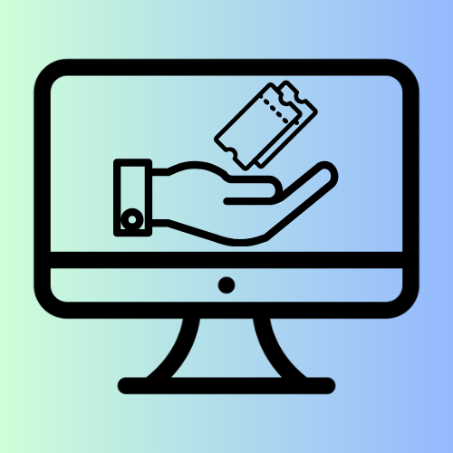
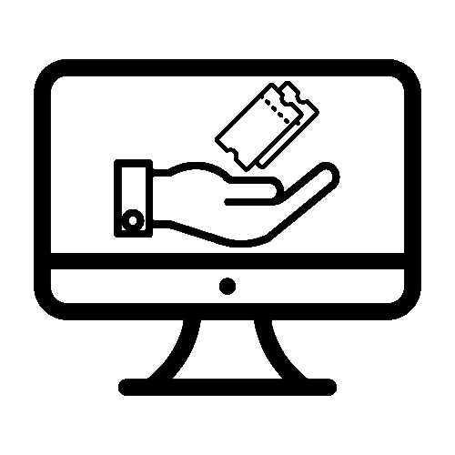
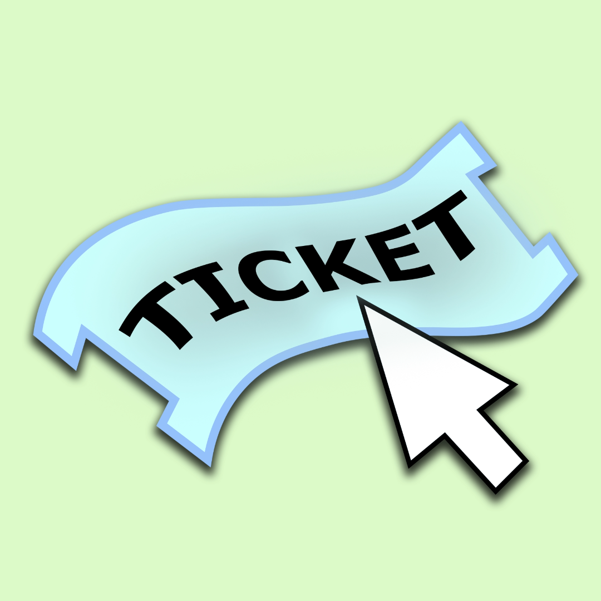

# Rapport de spécification : charte Graphique et logo

**Godineau Thomas**, **Rodier Matis**, **Chiron Jules**, **Ouvrard Maxence**

Groupe : **INF2 - FI A**

## Charte graphique

Le document suivant a pour objectif de vous présenter la charte graphique de notre application web
ainsi que les différents logos qui ont été créés afin de réaliser notre site.
Commençons tout d’abord par la charte graphique. Dans cette partie, nous allons aborder les différents choix esthétiques que nous avons pris.
Les différents choix de la charte graphique ont été effectués en accord avec les différents membres du groupe lors d’un brainstorming.

### Palette de couleurs

Tout d’abord, commençons par la palette de couleur.
Nous avons opté pour des nuances de vert et bleu qui sont toutes les deux des couleurs pastel.
Cela permet donc à l’application ainsi qu’au logo de ne pas avoir de couleurs agressives.
Le vert est la couleur qui est associée à l'aide, à la santé et à l'apaisement.
Dans le cadre d'un projet basé sur la résolution de problèmes utilisateurs et sur l'aide, le vert représente le support et l’aide apporté par les techniciens et l’administrateur web.
Il s'agit de la couleur essentiel qui se doit d'apparaître sur le logo.
Même si le domaine de cette application n’est pas la santé, nous sommes sur un domaine de la réparation et de la défaillance informatique, ce qui peut se rapprocher.
Ensuite, nous avons décidé de le mélanger avec du bleu. Comme pour le vert, le bleu a été utilisé pour une signification donnée. En effet, le bleu est utilisé pour représenter la sérénité, l’ordre et la confiance.
Nous avons donc deux couleurs qui inspirent le calme ainsi que la confiance.
L’objectif est d’avoir un logo ainsi qu’un site avec un environnement de couleurs mettant à l’aise l’utilisateur.
Pour les niveaux d’urgence, nous avons établie quatre couleurs :

- vert pour le niveau 1
- jaune pour le niveau 2
- orange pour le niveau 3
- rouge pour le niveau 4

Nous rappelons que le niveau l’urgence le plus élevé est le 4 est le moins élevé est 1.

Nous rappelons également que pour une accessibilité pour tous le niveau des tickets est marqué
pour aider les personnes ayant des difficultés pour différencier les couleurs.

### Couleurs principales

Dans cette partie, abordons les couleurs principales. Commençons avec la couleur de fond.
Nous utilisons une couleur pour l’entête et le pied de la page. Le fond de l’entête est un dégradé partant du bleu depuis le haut de la page vers du vert jusqu'à la barre de navigation qui sera de la couleur verte vers laquelle tend le dégradé précédant.
Le pied de page sera de la même couleur que la barre de navigation.
Pour le reste de la page, celui-ci  aura un fond blanc afin de laisser un style épuré et moderne.
Le texte quant à lui est de couleur noir, que ce soit un lien ou du simple texte.
Le noir contrastant très bien avec le font blanc du corps de la page mais également
avec les couleurs pastelles utilisées dans l’entête et le pied de page.

### Typographie

Après la couleur du texte, abordons sa typographie. Depuis quelques années, la loi française oblige les sites web à être accessibles à tous en respectant des normes.
C’est dans ce contexte que nous avons choisi la typographie utilisée.
Il n’existe pas de police d’écriture obligatoire dans les normes mais certaines d'entre elles sont  plus simples à lire pour une majorité de personnes. C’est le cas de Verdana.
Nous avons choisi cette typographie parce qu’elle est faite de formes simples et est facilement lisible, c’est ce qu’on appelle une police sans-sérif, sans décorations.
Il s’agit d’une police qui a été conçue pour les écrans d'ordinateurs.
Elle permet de rendre plus lisible les textes qui sont écrits dans des longs blocs.

### Interface et Formes

Poursuivons avec le choix de l’interface et des formes.
Durant notre brainstorming nous avons défini les deux mots qui doivent être considérés
comme la base afin de réaliser tout le travail. Les deux mots que nous avons choisi sont épurés et modernes.
Pour ce qui est des formes, nous avons décidé de partir sur quelque chose de simple mais efficace.
Pour les boutons, nous allons opter pour des formes simples, comme des rectangles aux coins arrondis, pour une apparence propre et conviviale. Les boutons principaux seront mis en évidence par une couleur de fond légèrement différente de celle de l'arrière-plan, avec une transition fluide au survol.
Cela permettra d'indiquer clairement les éléments interactifs aux utilisateurs.

### Accessibilité et Contraste

Continuons avec l’accessibilité et les contrastes.
Premièrement, nous plaçons l'accessibilité au cœur de notre démarche, nous assurant que chacun puisse profiter pleinement de notre application.
Les choix de couleurs que nous avons adoptés ont été choisies pour offrir un contraste avec le texte.
Le vert et le bleu pastel sont des teintes qui contrastent fortement avec le texte noir, créant une lisibilité optimale pour une majorité d’utilisateurs.
Deuxièmement, pour garantir une expérience utilisateur fluide et accessible, nous avons mis en place certains événements.
Lorsque les boutons ou les liens sont survolés par le curseur de la souris ou par la touche de tabulation, ils changent de couleur de manière distinctive.
Ce changement de couleur est conçu pour améliorer la visibilité, offrant ainsi une meilleure utilisation du site,
particulièrement pour ceux qui dépendent de lecteurs d'écran.

### Ton de la Communication

Enfin, terminons avec le ton de communication. Pour une application, il est essentiel de bien choisir le ton employé afin que notre outil puisse rester professionnel.
Nous envisageons donc d’employer un langage professionnel et informatif afin de refléter la qualité des services que propose l’application. L’objectif est de mettre à l’aise l’utilisateur, qu’il se sente respecté et qu’il comprenne que le but final est de les aider.
Nous allons donc employer un langage qui sera accessible à tous, sans employer de termes informatiques techniques qui pourraient perturber certaines personnes ne travaillant pas dans le domaine informatique.

## Logos

### Premier logo

**Figure 1** : Logo 1 en couleur

**Figure 2** : Logo 1 en noir et blanc

Le premier logo est un logo au format carré réalisé grâce à la plateforme de conception graphique Canva.
Il s'agit d'un logo sous la forme de pictogramme, cela veut dire qu'il s'agit d'un logo qui représente un véritable objet ou un dessin schématique le représentant.

Commençons par la description de ce que nous voyons au centre et ce que nous pourrions appeler le premier plan.
Le centre est composé de trois éléments blancs qui se détachent du fond par l'effet d'un contraste très prononcé.
Nous pouvons les retrouver en noir sur la deuxième version du logo. Ces trois éléments sont picturaux.
Nous retrouvons en plus gros un écran d'ordinateur sur pied, prenant la place centrale sur ce logo.
Ensuite nous retrouvons à l'intérieur de celui-ci une main tendue et enfin plusieurs tickets au-dessus de celle-ci.
Pour ce qui est du fond, nous voyons un dégradé de couleurs entre le vert et le bleu clair.

Passons maintenant à l'analyse. Comme nous l'avons dit précédemment, il s'agit d'un logo pictogramme, ce qui veut dire que les éléments placés dans le logo, que ce soit leur choix ou leur positionnement dans celui-ci, ont une signification. Commençons par les couleurs, le dégradé a été choisi premièrement dans un but esthétique, mais aussi pour rejoindre la charte graphique.
En effet, dans celle-ci il est indiqué que le site se doit d'être moderne et épuré.
C'est pour cela que le choix du dégradé s'est porté car il s'agit de quelque chose d'assez moderne.
De plus, les couleurs ont été choisies pour qu'elles ne soient pas vives, dans les logos actuels, nous ne retrouvons que très peu de couleurs très vives.
C'est pour ça que l'emploi de couleurs dans des tons plus froids et pastels a été choisi.
À présent, passons à l'analyse des éléments.
Le choix de l'écran de l'ordinateur a tout d'abord été effectué dans le but de faire comprendre sur quel support sera proposé l'application.
Mais cela fait aussi référence aux ordinateurs qui sont mis à disposition dans l'enceinte de L'IUT.
Le logo se veut donc s'adapter à son domaine d'exploitation.
Ensuite, à l'intérieur nous retrouvons les deux éléments précédemment définis: la main et les tickets.
Premièrement, la main symbolise l'aide. En effet, nous pouvons voir ce logo comme si la main recevait le ticket.
Comme si l'utilisateur envoyait le ticket et que c'est la main de l'administrateur qui est tendu.
Dans l'utilisation quotidienne de l'application Web, ce sont les techniciens qui viendront aider.
C'est donc la main des techniciens et de l'administrateur qui est tendue. Deuxièmement, les tickets.
Ils ont été mis au nombre de deux pour symboliser la pluralité des tickets.
En effet, cette plateforme va recevoir de nombreux relevés de problème et donc de nombreux tickets.
Enfin, nous pouvons voir qu’ils possèdent une partie détachable.
Nous pouvons donc l’aborder comme la partie qui sera détachée à la prise en charge du ticket ou bien lors de la conclusion du sujet du ticket, comme nous pouvons le vivre dans un cinéma, une fois rentrés dans la salle de projection.

Pour conclure nous avons vu que ce logo a donc pour but de respecter la charte  graphique en essayant d'être épuré et moderne. De plus, le logo est basé sur le concept de l'aide qui est pour nous primordial dans ce projet. Car cette application a pour but d'aider et non pas juste de dossier de relevé de problèmes.

### Deuxième logo

**Figure 3** : Logo 2 en noir et blanc

**Figure 4** : Logo 2 en couleur

Continuons avec le deuxième logo. Pour celui-ci nous avons également utilisé le site Web Canva afin de le réaliser.
Il s'agit également d'un logo pictogramme, mais aussi typographique avec le mot ticket d’écrit dessus.

Tout d'abord, abordons la description du logo.
Ce logo est composé de deux éléments très concrets et facilement reconnaissables.
Il y a premièrement au centre du logo un gros ticket. Celui-ci est ondulé sur sa longueur.
À l'intérieur, un texte suit l'inclinaison ainsi que les courbes du ticket.
Il est écrit “TICKET” en majuscule avec la police Verdana pour respecter la charte graphique.
Le deuxième élément qui se situe en bas à droite du ticket, est un curseur de souris en forme de flèche.
Celui-ci se place au-dessus du ticket et semble prêt à le sélectionner ou cliquer dessus.
Passons maintenant à l'arrière-plan. Contrairement à l'autre logo, la première version de celui ci se veut être en noir et blanc.
Une autre version en couleur a été réalisée en accord avec les couleurs choisies dans la charte graphique.
Cela se retrouve donc dans la deuxième version, le vert en arrière-plan et le bleu dans le ticket.
Pour ce qui est du curseur de souris, celui ci ne change pas, il est en blanc.

Passons désormais à l'analyse du logo. Tout d'abord pourquoi avoir choisi un logo avec peu d'éléments ?
Le but principal de celui-ci est de créer une vraie identité visuelle, qu’avec rien qu'un simple coup d'œil, le logo puisse être reconnu. C'est donc une véritable aide pour les utilisateurs d'avoir un logo qui se démarque, qui est simple et clair. Mais il a aussi une autre visée. Un logo doit permettre à une personne qui n'a jamais utilisé l'application de comprendre à la simple vue du logo à quoi l'application peut servir.
C’est grâce au ticket que nous parvenons à faire passer cette information. Sa taille montre également
l’importance de sa signification. C'est dans cette optique là que nous avons choisi un logo avec très peu d'éléments.
Il respecte également le principe de la clarté, par la simplicité des éléments, et de la modernité, par la présence du curseur qui ramène directement à l’informatique et donc au principe d’application.

### Choix du logo

Pour terminer, nous allons aborder le choix du logo final en nous posant deux questions.
Premièrement quel logo qui va intégrer notre application web mais aussi pourquoi nous avons choisi celui plutôt qu’un autre.

Premièrement quel logo avons-nous choisi ?

Le choix de celui-ci a été déterminé au cours d’un brainstorming avec tous les membres de l’équipe.
Nous avons cherché les points forts et points faibles de chaque logo afin d’être sûr qu’il correspondait à nos besoins ainsi que ceux du client.
Pour intégrer notre application web, nous avons choisi le premier logo dans sa version en noir et blanc.

Deuxièmement, pourquoi avons-nous choisi ce logo et cette version précise ?
Le logo a été choisi car il répondait plus à nos attentes ainsi qu’à la charte graphique.
En effet, nous souhaitons réaliser un site moderne et épuré.
Même si le deuxième logo est épuré en termes de nombre d’éléments présents, le premier présente un rapprochement avec ce que nous pouvons trouver dans le minimalisme avec la simplicité de la représentation. Le second logo propose une vue en trois dimensions tandis que le premier propose une vue en deux dimensions.
Finalement, nous avons donc un logo plus épuré avec pourtant plus d’éléments picturaux.

De plus, au niveau des idées proposées dans chacun des deux logos, une a retenu plus particulièrement notre attention.
Il s’agit de la notion d’aide qui est, pour nous, le point essentiel de ce projet.
La plateforme qui sera développée a pour but d’aider, il faut donc que ce concept soit retranscrit dans le logo.
Nous avons cette notion avec la présence du vert, cependant, les deux logos possèdent une version colorée.
C’est donc l’élément de la main tendue et des logos au-dessus qui nous ont marqués.
Il s’agit de ce qui ressort le plus dans le logo. En effet, il s’agit de l’élément central, soit une des premières choses que verront les utilisateurs.
À présent, nous allons expliquer pourquoi nous avons choisi la version en noir et blanc.
Nous avons précédemment abordé le choix des couleurs présentes dans les deux logos ou même sur le site web.
Nous avons donc vu que le site et le logo possèdent les mêmes couleurs.
Afin d’éviter tout problème avec les dégradés présents dans l’entête du site ou bien autour du logo, nous avons décidé de prendre une version du logo avec un fond transparent.
Enfin, nous avons choisi une version avec les éléments en noir afin de créer un contraste entre le fond du site web et la couleur de notre logo.
Pour conclure, nous avons choisi le premier logo que nous avons créé pour les valeurs qu’il présente et que nous avons jugé plus intéressantes que dans le second.
