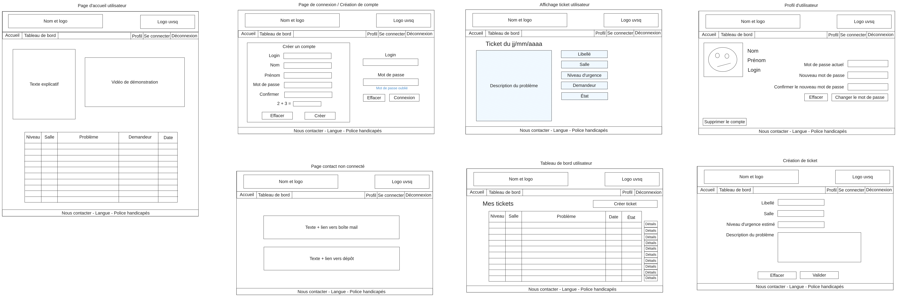
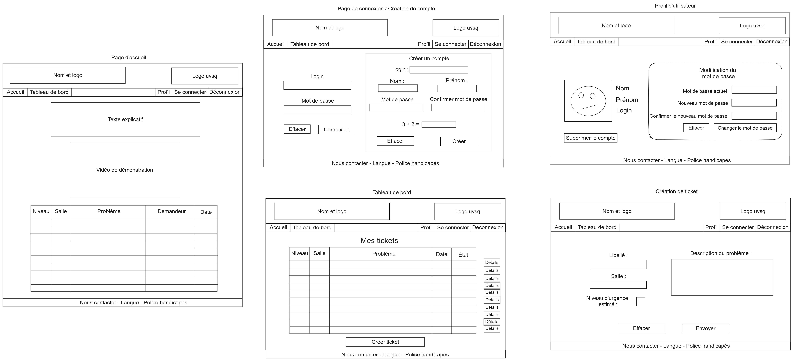
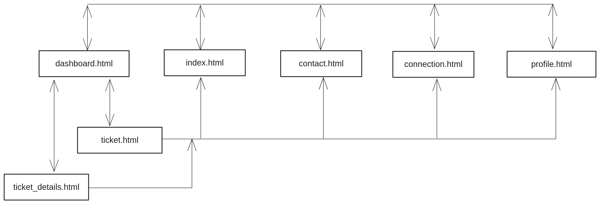

# Rapport de spécification : maquettes html

**Godineau Thomas**, **Rodier Matis**, **Chiron Jules**

Groupe : **INF2 - FI A**

## Introduction

Ce présent rapport a pour but de présenter les maquettes html du site web statique. Cette version du projet contient un ensemble de pages html, une feuille de style CSS et des images. Ce rapport contient également le plan du site web.

## Méthode

Nous avons d'abord commencé par réaliser des schémas de chaque page du site web pour chacune des maquettes (cf [schéma maquette 1](#fg1), [schéma maquette 2](#fg3)). Nous avons ensuite réalisé les maquettes html de chaque page.

## Présentation générale 

Pour chacune des maquettes, nous avons décidé de proposer les pages qui concernent l'utilisateur (accueil, connexion, contact, tableau de bord, création de ticket, affichage de ticket, profil). En effet, les pages d'utilisateurs permettent de montrer différents éléments du site (tableaux, formulaires, textes). Afin de montrer toutes les mécaniques du site, nous avons mis dans le header à la fois le lien de connexion et de déconnexion (cela différera dans la version finale du projet). De même, nous avons ajouté des liens pour changer la langue et la police. Ces liens feront appel à des fichiers PHP dans le futur, pour l'instant ils rafraîchissent uniquement la page.

Le contenu des pages entre les maquettes est le même, seul le style et la disposition des éléments changent.

### Tableaux 

Le contenu et les en-têtes des tableaux diffèrent en fonction des utilisateurs. Ainsi, sur la page d'accueil, nous affichons les 10 derniers tickets encore ouverts (conformément au cahier des charges). Sur cette page, nous affichons le niveau d'urgence d'un ticket, la salle dans laquelle se trouve le problème, le titre du ticket, le demandeur et la date de création du ticket. De ce fait, cette page peut servir à n'importe quel utilisateur afin de ne pas créer de tickets en double.

Sur le tableau de bord de l'utilisateur, nous affichons uniquement les tickets créés par l'utilisateur connecté. Nous n'affichons donc plus le demandeur d'un ticket. Cependant, nous avons ajouté un bouton à côté de chaque ligne (1 ligne = 1 ticket) pour afficher le détail d'un ticket. Ce bouton est un lien vers la page d'affichage d'un ticket.

### Header

Le header contient le logo de l'application ainsi que celui de l'IUT de Vélizy.
Pour un utilisateur connecté, il contient un lien vers la page d'accueil, un lien vers le tableau de bord, un lien vers la page de profil et un lien pour se déconnecter (renvoie vers la page d'accueil). Nous avons rajouté le lien vers la page de connexion (cf [Présentation générale](#pre_generale)).

Pour la version finale du site, il est prévu de créer plusieurs header et d'afficher uniquement celui qui concerne l'utilisateur actuellement connecté.

### Footer

Le footer contient un lien vers la page de contact, un lien pour changer la langue et un lien pour appliquer une police adaptée aux personnes dyslexiques. Ces deux derniers liens n'ont pas encore de fonctionnalités mais servent à avoir une idée générale du site final.

### Page d'accueil

La page d'accueil contient un texte explicatif expliquant le but et le fonctionnement de la plateforme ainsi qu'une vidéo expliquant également le fonctionnement (nous affichons juste une vidéo youtube pour l'instant). Cette page contient aussi le premier tableau présenté dans la [présentation des tableaux](#tableaux).

### Tableau de bord

Le tableau de bord est la page centrale pour l'utilisateur. Cette page contient le deuxième tableau présenté dans la [présentation des tableaux](#tableaux). Elle contient également un bouton pour créer un ticket. Ce bouton est un lien vers la page de création de ticket.

### Création de ticket

La page de création de ticket contient un formulaire permettant de créer un ticket. Ce formulaire contient un champ pour le titre du ticket, un champ pour la salle dans laquelle se trouve le problème, un champ pour le niveau d'urgence du ticket, un champ pour la description du problème et un bouton pour envoyer le formulaire. Ce bouton n'a pas encore de fonctionnalité mais servira à envoyer le formulaire à la base de données, pour l'instant, il renvoie vers le tableau de bord.

### Affichage de ticket

La page d'affichage de ticket contient les informations d'un ticket. Ces informations sont le titre du ticket, la salle dans laquelle se trouve le problème, le niveau d'urgence du ticket, la description du problème, la date de création et l'état du ticket. Cette page contient un bouton pour valider le formulaire. Ce bouton n'a pas encore de fonctionnalité mais servira à fermer le ticket dans la base de données, pour l'instant, il renvoie vers le tableau de bord. Cette page contient également un bouton pour effacer le formulaire.

### Profil

La page de profil contient les informations de l'utilisateur. Ces informations sont le nom, le prénom et le login. Cette page contient également un formulaire pour changer de mot de passe et un bouton pour supprimer son compte (pour l'instant sans fonctionnalité).

### Connexion

La page de connexion contient un formulaire pour se connecter. Ce formulaire contient un champ pour le login et un champ pour le mot de passe. Ce formulaire contient également un bouton pour envoyer le formulaire. Pour l'instant, ce bouton renvoie vers le tableau de bord.

Nous avons décidé d'inclure la création de compte dans la même page que la page de connexion afin d'améliorer l'expérience utilisateur. Ainsi, nous avons ajouté un formulaire pour créer un compte. Les deux formulaires sont distinctement séparés (un contient une bordure). Le formulaire de création de compte contient un champ pour le nom, un champ pour le prénom, un champ pour le login, un champ pour le mot de passe, un champ pour confirmer le mot de passe et un bouton pour envoyer le formulaire. Pour l'instant, ce bouton renvoie vers le tableau de bord.

### Contact

La page contact contient deux textes avec chacun un lien. Le premier renvoie vers un client mail avec un message à remplir destiné à une adresse mail de contact. Le deuxième lien renvoie vers le dépôt github du projet.

## Plan du site web

Le plan du site web se trouve en [Figure 3](#fg3). Il représente la navigabilité entre les pages du site. Il contient les pages suivantes : [*index.html*](../../src/pages/index.html), [*dashboard.html*](../../src/pages/dashboard.html), [*ticket.html*](../../src/pages/ticket.html), [*ticket_details.html*](../../src/pages/ticket_details.html), [*profile.html*](../../src/pages/profile.html), [*contact.html*](../../src/pages/contact.html) et [*connection.html*](../../src/pages/connection.html).

Les pages *index*, *dashboard*, *profile*, *connection* et *contact* sont accessibles toutes accessibles entre elles. Les pages *ticket* et *ticket_details* ont également accès à ces pages mais sont accessibles uniquement depuis la page *dashboard*.

## Annexes

**Figure 1** : schéma de la maquette 1

**Figure 2** : schéma de la maquette 2

**Figure 3** : plan du site web
