# Rapport de tests d'acceptation

**Godineau Thomas**, **Rodier Matis**, **Chiron Jules**

Groupe : **INF2 - FI A**

## Introduction

Ce présent rapport a pour but de comparer les schémas de notre maquette html avec les pages web de notre plateforme. Ainsi, nous pourrons évaluer la conformité des pages avec les schémas de la maquette.

## Comparaison

Toutes les captures d'écran se trouvent en annexes. Pour chaque élément, la schéma de la maquette précède la capture d'écran de la page web afin de pouvoir les comparer. Les couleurs et les logos ont été choisis en lien avec la [charte graphique](../Specification/charte_graphique.md).

### Remarques : header et footer

Le *header* et le *footer* étant présents sur toutes les pages, nous avons décidé de les comparer une seule fois avec leur schéma respectif.

#### Header

Nous avons créé un unique schéma de header qui comporte les éléments présents pour un utilisateur.

## Conclusion

Tous les éléments présents sur les schémas sont aussi présents sur les maquettes. On peut remarquer que les dimensions de certains éléments varient. Cela vient des différences de dimensions de fenêtre entre nos pages et les schémas.

 Nous pouvons donc considérer que les pages web sont **conformes aux schémas** et que le résultat de ce test d'acceptation est positif.

## Annexes

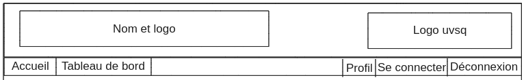
**Figure 1** : [Schéma du header](../annexes/header_schema.png)

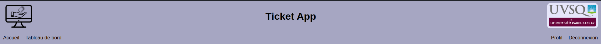
**Figure 2** : [Header du site web](../annexes/header_site.png)

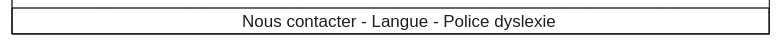
**Figure 3** : [Schéma du footer](../annexes/footer_schema.png)

**Figure 4** : [Footer du site web](../annexes/footer_site.png)

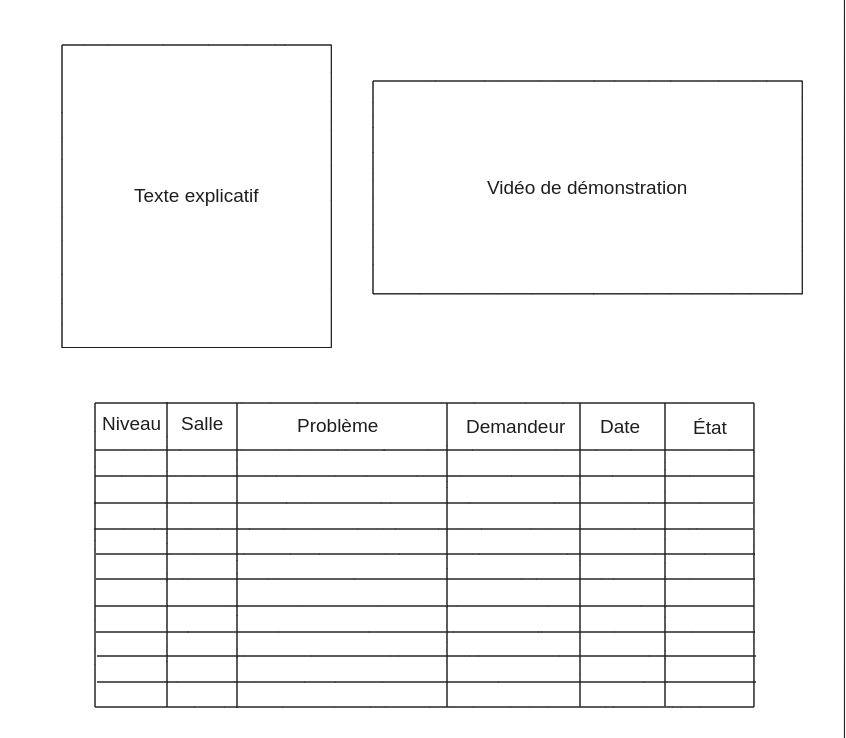
**Figure 5** : [Schéma de la page d'accueil](../annexes/index_schema.png)

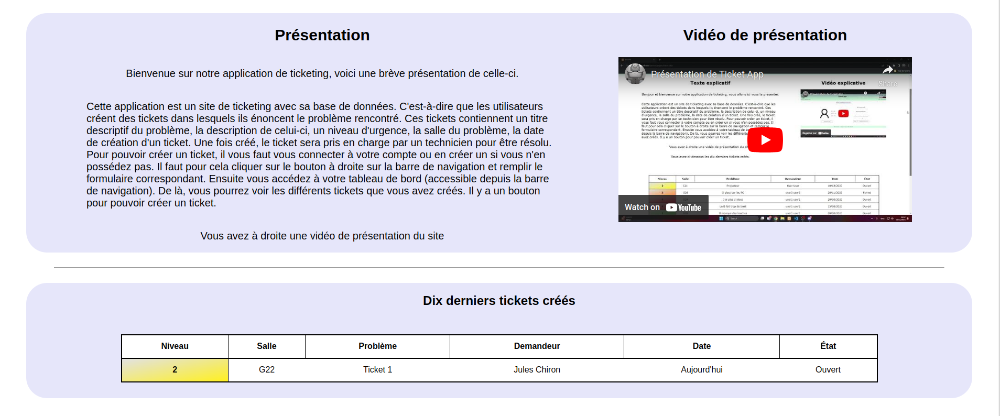
**Figure 6** : [Page d'accueil du site web](../annexes/index_site.png)

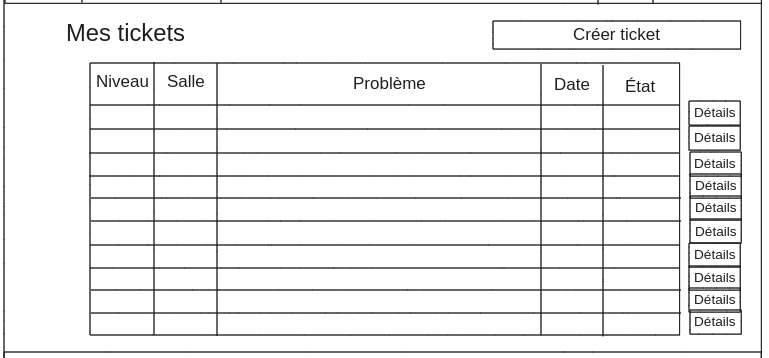
**Figure 7** : [Schéma du tableau de bord](../annexes/dashboard_schema.png)

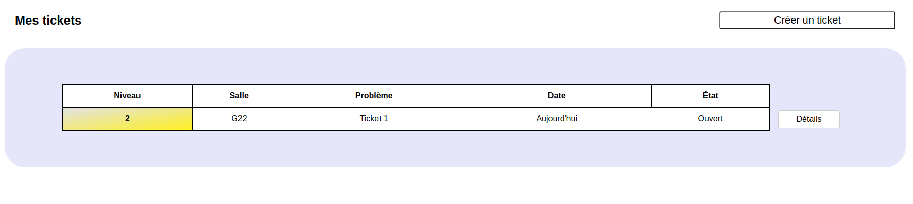
**Figure 8** : [Tableau de bord du site web](../annexes/dashboard_site.png)

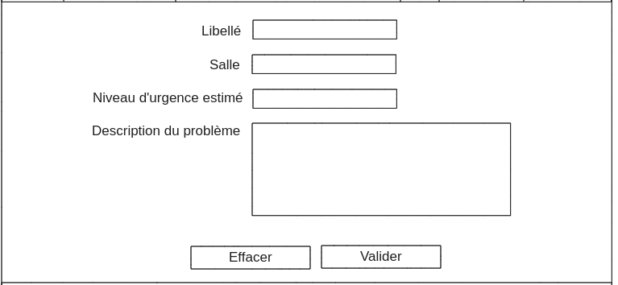
**Figure 9** : [Schéma de la page de création de ticket](../annexes/ticket_schema.png)

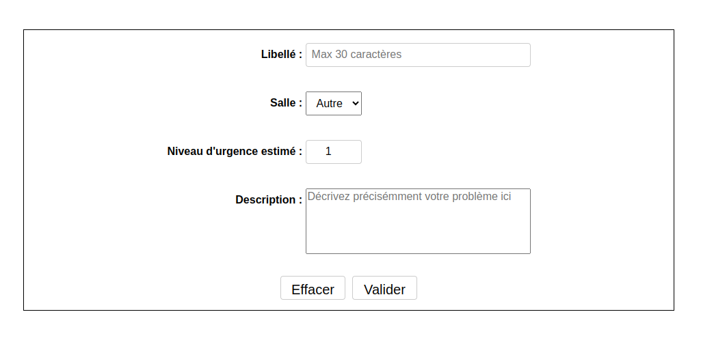
**Figure 10** : [Page de création de ticket du site web](../annexes/ticket_site.png)

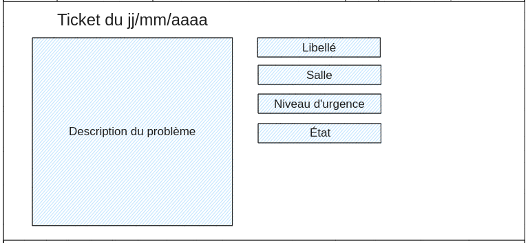
**Figure 11** : [Schéma de la page d'affichage de ticket](../annexes/ticket_details_schema.png)

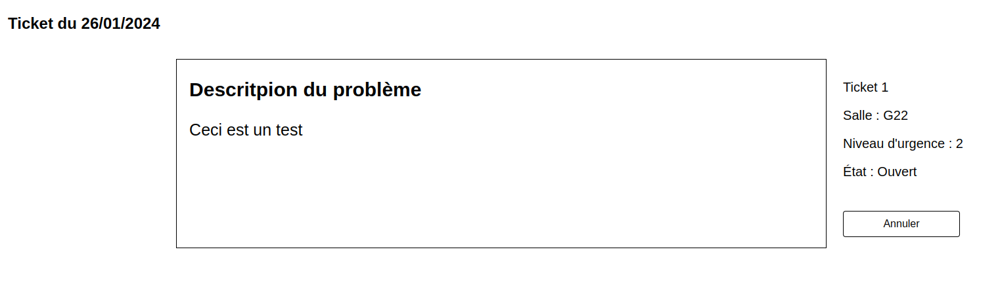
**Figure 12** : [Page d'affichage de ticket du site web](../annexes/ticket_details_site.png)

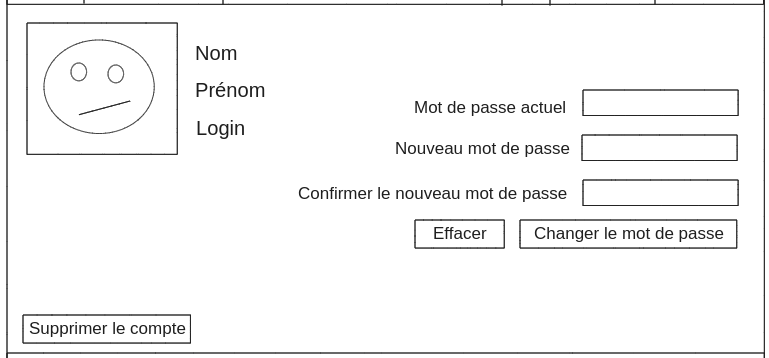
**Figure 13** : [Schéma de la page de profil](../annexes/profile_schema.png)

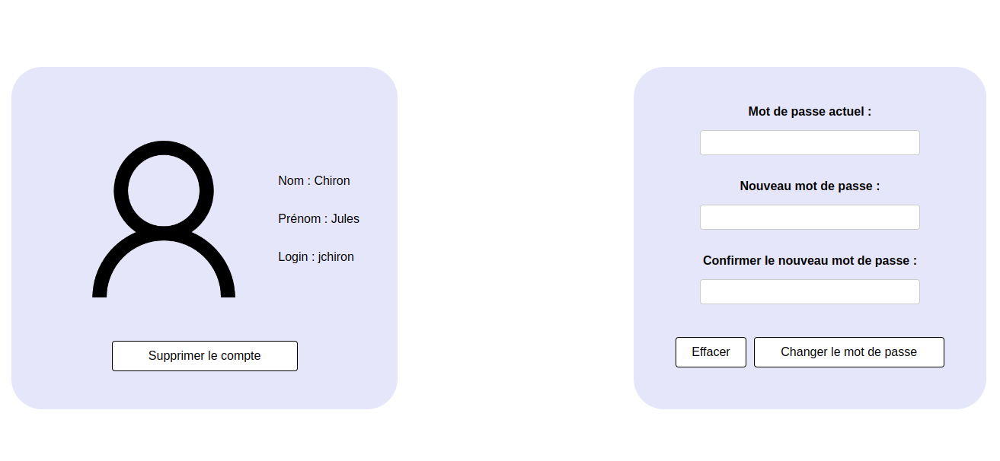
**Figure 14** : [Page de profil du site web](../annexes/profile_site.png)

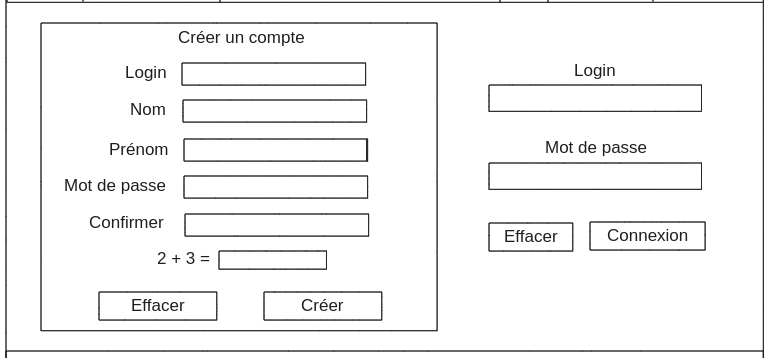
**Figure 15** : [Schéma de la page de connexion](../annexes/connection_schema.png)

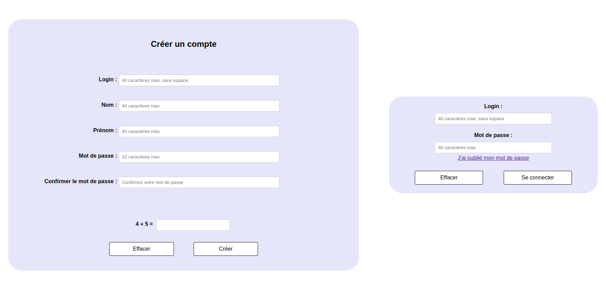
**Figure 16** : [Page de connexion du site web](../annexes/connection_site.png)

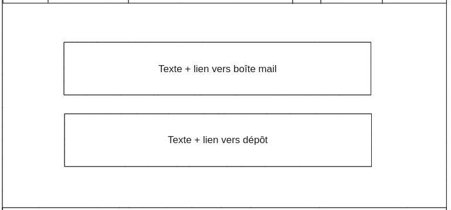
**Figure 17** : [Schéma de la page de contact](../annexes/contact_schema.png)

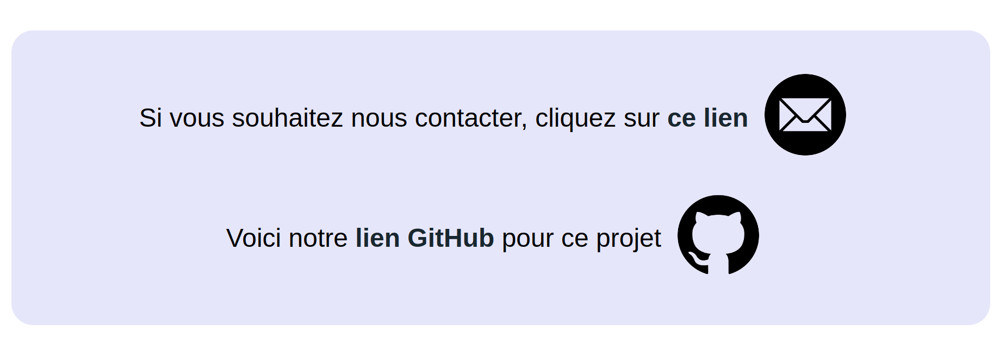
**Figure 18** : [Page de contact du site web](../annexes/contact_site.png)
