# Rapport de tests d'acceptation

**Godineau Thomas**, **Rodier Matis**, **Chiron Jules**

Groupe : **INF2 - FI A**

## Introduction

Ce présent rapport a pour but de comparer le schéma des maquettes html avec les pages html du site web statique. Ainsi, nous pourrons évaluer la conformité des pages html avec les schéma de maquettes.

## Comparaison

Toutes les captures d'écran se trouvent en annexes. Pour chaque élément, la schéma de la maquette précède la capture d'écran de la page html afin de pouvoir les comparer. Les couleurs et les logos ont été choisis en lien avec la charte [graphique](chemin_charte_graphique).

### Maquette 1

Pour la maquette 1, nous remarquons que tous les éléments présents sur le schéma sont aussi présents sur la maquette html. On observe cependant des différences dans les proportions des éléments. Ceci est dû au fait que nous avions mal anticipé la taille des fenêtres lorsque nous avons dessiné le schéma. Les dispositions des éléments sont également respectées sauf pour la page de profil. Effectivement, les boutons ont été réorganisés afin de rendre la page plus logique.

Enfin, on remarque également une différence entre les tailles des tableaux des schémas et ceux de la maquette. Cette différence est dûe au fait que nous n'avons créé que quelques tickets car cela suffit pour comprendre le site.

### Maquette 2

#### Remarque

Les header, footer, pages de contact et d'affichage de ticket de la maquette 2 sont les mêmes que ceux de la maquette 1.

Comme pour la maquette 1, tous les éléments présents sur le schéma se retrouvent sur la maquette. On observe encore ici des différences dans les proportions des éléments.

## Conclusion

Tous les éléments présents sur les schémas sont aussi présents sur les maquettes. De plus les schémas ont été en très grande partie respectés dans les pages html. Nous pouvons donc considérer que les pages html sont conformes aux schémas de maquettes et que le résultat de ce test d'acceptation est positif.

## Annexes

### Annexes maquette 1

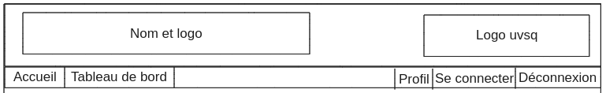
**Figure 1** : [Header du schéma 1](../annexes/header_schema_1.png)

**Figure 2** : [Header de la maquette 1](../annexes/header_maquette_1.png)

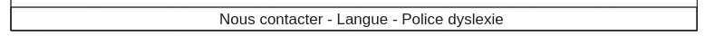
**Figure 3** : [Footer du schéma 1](../annexes/footer_schema_1.png)

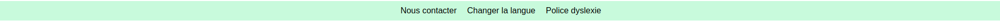
**Figure 4** : [Footer de la maquette 1](../annexes/footer_maquette_1.png)

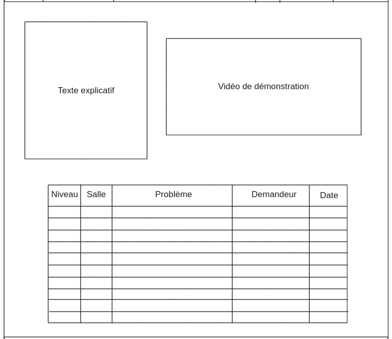
**Figure 5** : [Page d'accueil du schéma 1](../annexes/index_schema_1.png)

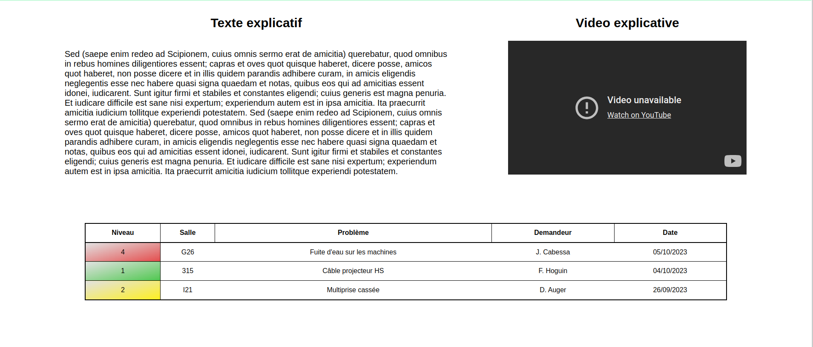
**Figure 6** : [Page d'accueil de la maquette 1](../annexes/index_maquette_1.png)

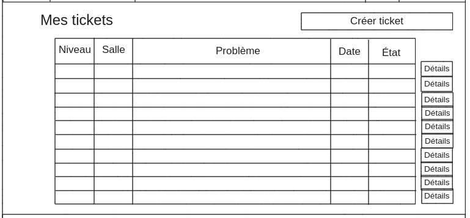
**Figure 7** : [Tableau de bord du schéma 1](../annexes/dashboard_schema_1.png)

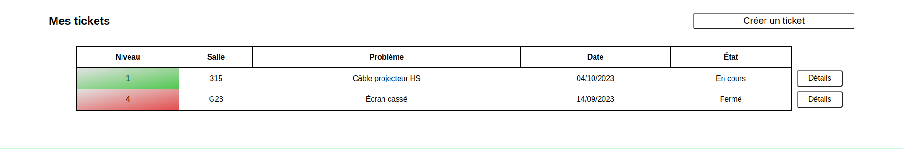
**Figure 8** : [Tableau de bord de la maquette 1](../annexes/dashboard_maquette_1.png)

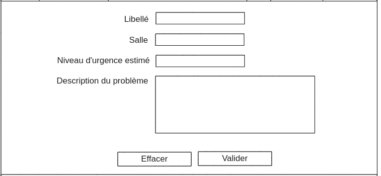
**Figure 9** : [Page de création de ticket du schéma 1](../annexes/ticket_schema_1.png)

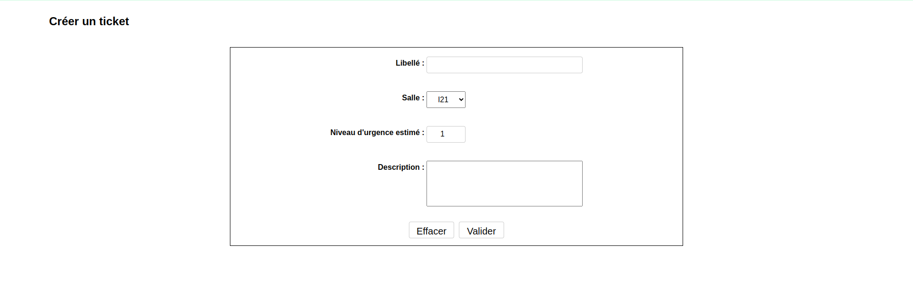
**Figure 10** : [Page de création de ticket de la maquette 1](../annexes/ticket_maquette_1.png)

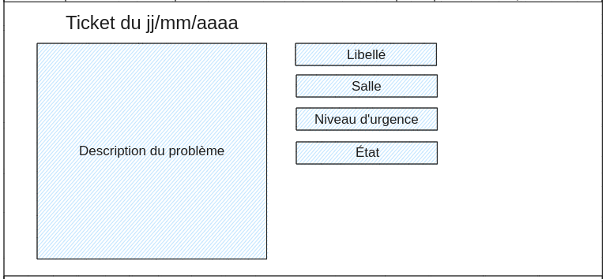
**Figure 11** : [Page d'affichage de ticket du schéma 1](../annexes/ticket_details_schema_1.png)

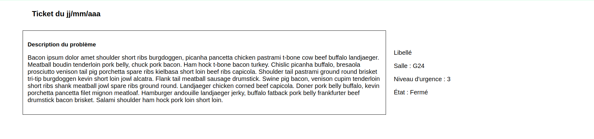
**Figure 12** : [Page d'affichage de ticket de la maquette 1](../annexes/ticket_details_maquette_1.png)

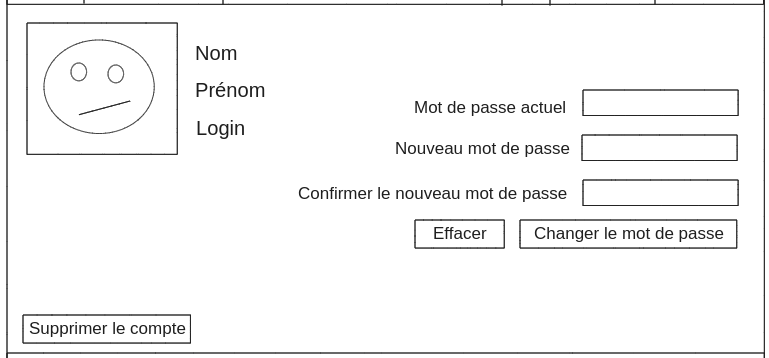
**Figure 13** : [Page de profil du schéma 1](../annexes/profile_schema_1.png)

**Figure 14** : [Page de profil de la maquette 1](../annexes/profile_maquette_1.png)

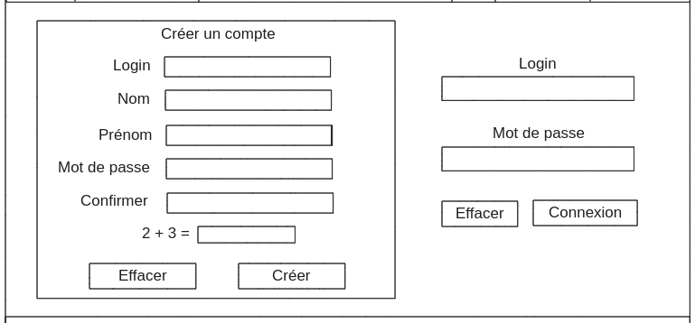
**Figure 15** : [Page de connexion du schéma 1](../annexes/connection_schema_1.png)

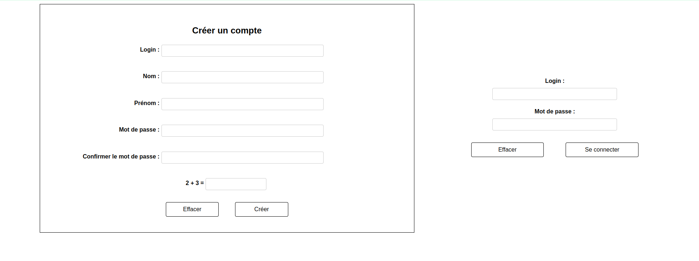
**Figure 16** : [Page de connexion de la maquette 1](../annexes/connection_maquette_1.png)

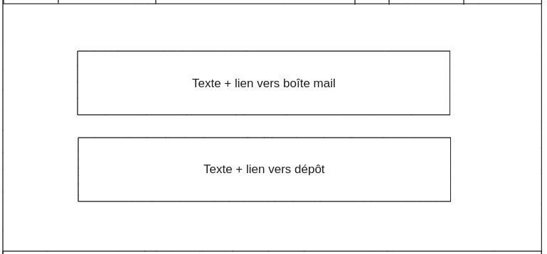
**Figure 17** : [Page de contact du schéma 1](../annexes/contact_schema_1.png)

**Figure 18** : [Page de contact de la maquette 1](../annexes/contact_maquette_1.png)

### Annexes maquette 2

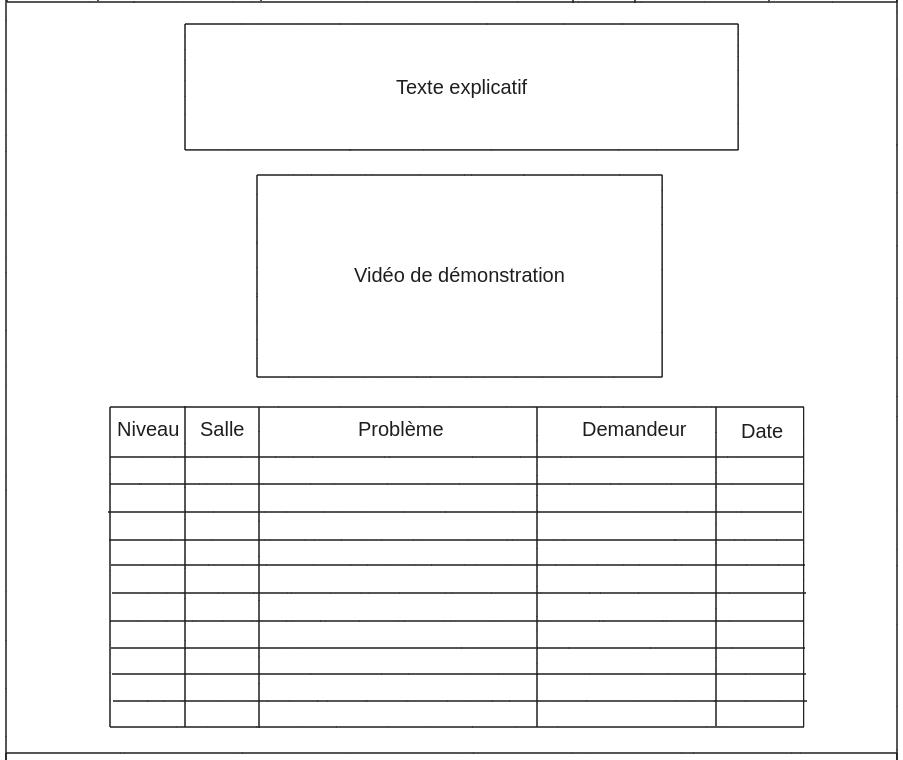
**Figure 19** : [Page d'accueil du schéma 2](../annexes/index_schema_2.png)

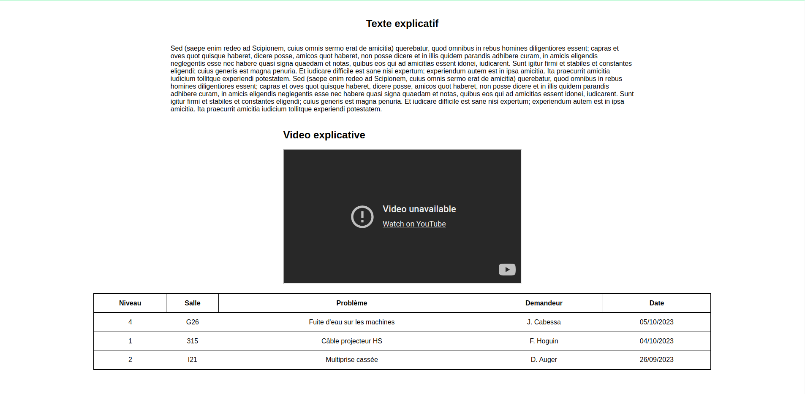
**Figure 20** : [Page d'accueil de la maquette 2](../annexes/index_maquette_2.png)

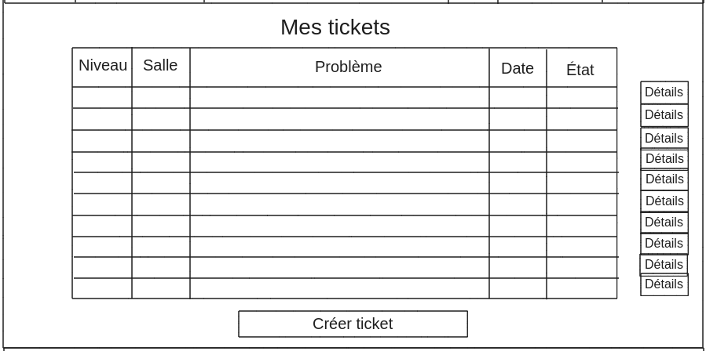
**Figure 21** : [Tableau de bord du schéma 2](../annexes/dashboard_schema_2.png)

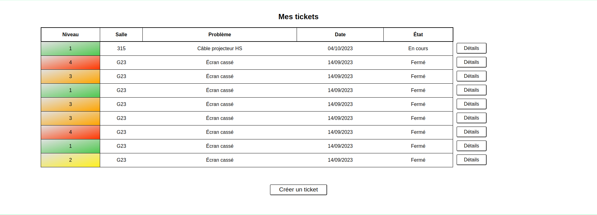
**Figure 22** : [Tableau de bord de la maquette 2](../annexes/dashboard_maquette_2.png)

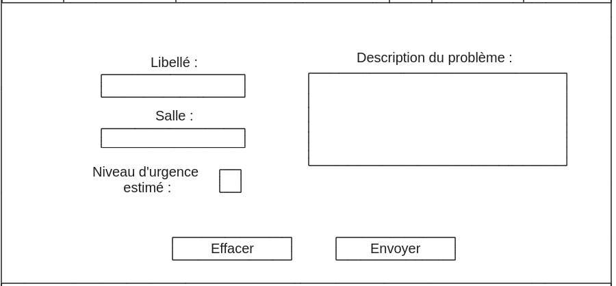
**Figure 23** : [Page de création de ticket du schéma 2](../annexes/ticket_schema_2.png)

**Figure 24** : [Page de création de ticket de la maquette 2](../annexes/ticket_maquette_2.png)

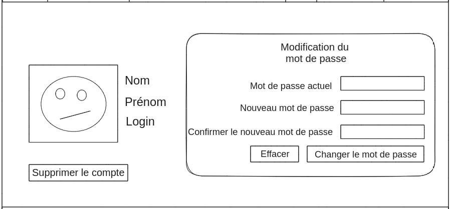
**Figure 25** : [Page de profil du schéma 2](../annexes/profile_schema_2.png)

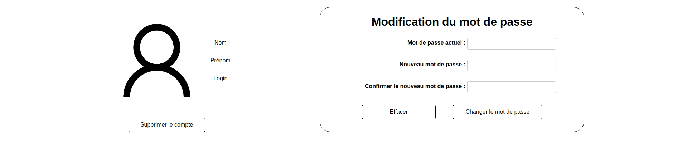
**Figure 26** : [Page de profil de la maquette 2](../annexes/profile_maquette_2.png)

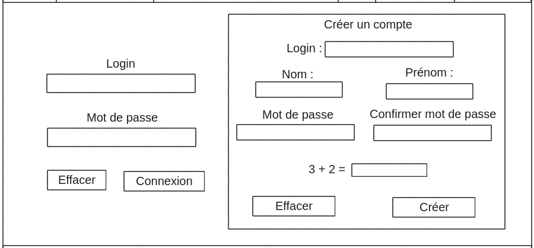
**Figure 27** : [Page de connexion du schéma 2](../annexes/connection_schema_2.png)

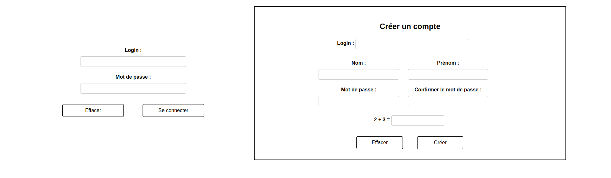
**Figure 28** : [Page de connexion de la maquette 2](../annexes/connection_maquette_2.png)
